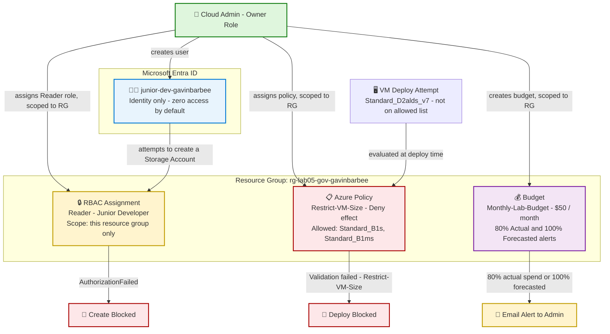

# Implementing Governance and Security Hardening in Azure

## 🎬 Watch Me Build This Lab!

loom coming soon

---

## 📖 Project Overview

This project demonstrates how to build **layered cloud governance** in Azure using three independent controls that work together: **Role-Based Access Control (RBAC)** to restrict who can act, **Azure Policy** to restrict what configurations are allowed regardless of who is deploying, and **Cost Management budgets** to detect abnormal spend before it becomes a bigger problem.

Rather than relying on a single control, this lab layers identity, configuration, and cost guardrails — mirroring how real organizations structure governance around the **NIST Cybersecurity Framework (CSF)**: know who has access (Identify), limit what can go wrong (Protect), and get alerted when something looks abnormal (Detect/Respond).

A simulated "Junior Developer" account is created with **Reader-only** access scoped to a single resource group, an Azure Policy is assigned to **deny** any VM size outside an approved list, and a monthly budget is configured with two alert thresholds (an *actual* spend alert and a *forecasted* spend alert). Each control is deliberately tested — not just configured — to prove it behaves as intended.

**Skills demonstrated:**

- Role-Based Access Control (RBAC) and the principle of least privilege
- Microsoft Entra ID user provisioning
- RBAC scoping to a resource group (not subscription-wide)
- Azure Policy definitions, assignments, scope, and the `Deny` effect
- Deploy-time policy evaluation and validation-failure interpretation
- Azure Cost Management budgets: actual vs. forecasted alert thresholds
- Governance-control verification (testing that a restriction actually restricts)
- Mapping hands-on cloud engineering work to the NIST Cybersecurity Framework

---

## 🏗️ Architecture Diagram

**How it works:** The Admin (Owner role) provisions a Junior Developer identity in Microsoft Entra ID, then explicitly grants it **Reader** access scoped only to `rg-lab05-gov-gavinbarbee` — Azure denies everything by default until an assignment says otherwise. Independently, an Azure Policy scoped to the same resource group **denies** any VM deployment using a size outside the approved list — this applies to *everyone*, including the Admin's own Owner account, because Policy governs configuration, not identity. A budget scoped to the resource group watches spend and fires an email alert at two independent thresholds: 80% of actual spend already incurred, and a forecasted-to-exceed-100% projection based on current trend. None of these three controls depend on each other — RBAC, Policy, and Budget each catch a different category of governance failure.

---

## ✅ Prerequisites

- [ ] Active Azure subscription (`az account show` or confirm access via [portal.azure.com](https://portal.azure.com))
- [ ] Permissions in Microsoft Entra ID to create users (User Administrator or Global Administrator)
- [ ] Incognito or private browser window available (used to simulate logging in as the Junior Developer without logging out of the Admin account)
- [ ] ~15–30 minutes of patience after the Policy assignment step — Azure Policy propagation is not instant

---

## 🏷️ Naming Conventions Used

| Resource                    | Value                                                     |
| ---------------------------- | ---------------------------------------------------------- |
| Resource Group               | `rg-lab05-gov-gavinbarbee`                                  |
| Region                        | East US                                                     |
| Test User (UPN)              | `junior-dev-gavinbarbee@<yourtenant>.onmicrosoft.com`       |
| Test User (Display Name)     | `Junior Developer`                                          |
| RBAC Role Assigned           | `Reader` — scoped to the resource group                     |
| Policy Assignment Name       | `Restrict-VM-Size`                                          |
| Policy Allowed VM Sizes      | `Standard_B1s`, `Standard_B1ms`                              |
| Budget Name                  | `Monthly-Lab-Budget`                                         |
| Budget Amount                | `$50` / billing month                                        |
| Budget Alert Thresholds      | 80% Actual, 100% Forecasted                                  |

> `<yourtenant>` is a placeholder for the Entra ID tenant domain — this will be blurred in screenshots alongside Subscription IDs and other GUID-style identifiers.

---

## 🪜 Project Steps

### Step 1: Create the Lab Resource Group

Every governance control in this lab — the RBAC assignment, the Policy assignment, and the Budget — is scoped to this single resource group so nothing else in the subscription is affected.

1. Logged in to the Azure portal at [portal.azure.com](https://portal.azure.com)
2. Searched **Resource Groups** → **+ Create**
3. Subscription: confirmed the correct subscription was selected
4. Resource group name: `rg-lab05-gov-gavinbarbee`
5. Region: **East US**
6. Clicked **Review + create** → **Create**

---

### Step 2: Create the Junior Developer User in Microsoft Entra ID

Microsoft Entra ID is where identities live. This step is the NIST **Identify** function in practice — you have to know who a person is before you can grant or restrict what they can do.

1. Searched **Microsoft Entra ID** → **Users**
2. Clicked **+ New user** → **Create new user**
3. User principal name: `junior-dev-gavinbarbee` (Azure appends the tenant domain automatically)
4. Display name: `Junior Developer`
5. Under **Password**, unchecked "Auto-generate password" and set a temporary password
6. Clicked **Review + create** → **Create**

---

### Step 3: Assign the Reader Role, Scoped to the Resource Group

Creating a user grants zero access by default — this is "deny by default," a foundational security principle. Access has to be explicitly assigned.

1. Navigated to **Resource Groups** → `rg-lab05-gov-gavinbarbee`
2. Left menu → **Access control (IAM)**
3. Clicked **+ Add** → **Add role assignment**
4. Role tab: searched **Reader** → selected it → **Next**
5. Members tab: **+ Select members** → searched **Junior Developer** → selected → **Select**
6. Clicked **Review + assign**, then **Review + assign** again to confirm

---

### Step 4: Verify Least-Privilege Access with an Incognito Test

A governance control that has never been tested is a control you can't actually trust. This step proves the Reader role does what it's supposed to do.

1. Opened a new Incognito/Private browser window (to log in as a different user without signing out of the Admin session)
2. Navigated to [portal.azure.com](https://portal.azure.com)
3. Signed in as `junior-dev-gavinbarbee@<yourtenant>.onmicrosoft.com` using the temporary password
4. Completed the MFA/welcome prompts on first login
5. Navigated to **Resource Groups** — confirmed only `rg-lab05-gov-gavinbarbee` was visible
6. Opened `rg-lab05-gov-gavinbarbee` → **+ Create** → searched **Storage Account** → **Create**
7. Filled in any name and clicked **Review + create**

**Expected result:** a red validation error — `AuthorizationFailed` — confirming the Reader role cannot create resources.

✅ **Result:** the Junior Developer can observe the environment but cannot modify it — the NIST **Protect** function working as intended.

---

### Step 5: Create an Azure Policy to Restrict VM Sizes

RBAC controls *who* can act. Azure Policy controls *what configurations* are allowed — and it applies to everyone, including Owner accounts. A `Deny` policy cannot be bypassed by having more permissions.

1. Searched **Policy** → left menu, under **Authoring** → **Assignments**
2. Clicked **Assign policy**
3. **Scope**: selected the subscription, then `rg-lab05-gov-gavinbarbee` as the resource group
4. **Policy definition**: searched `Allowed virtual machine size SKUs` → selected it → **Add**
5. **Assignment name**: `Restrict-VM-Size`
6. Parameters tab: unchecked "Only show parameters that need input" → set **Allowed Size SKUs** to `Standard_B1s` and `Standard_B1ms`
7. Clicked **Review + create** → **Create**

> ⏱️ Policy propagation is not instant — allow 10–30 minutes before testing in Step 6.

---

### Step 6: Test the Policy — Prove the Deny Effect

Governance controls should be proven, not assumed. This step deliberately violates the policy to confirm it actually blocks a non-approved configuration.

1. Navigated to `rg-lab05-gov-gavinbarbee` → **+ Create** → searched **Virtual Machine** → **Create**
2. Set VM name `vm-test-1`
3. Size: selected a size not on the allowed list. Azure's size picker offered `Standard_D2alds_v7` (a similar non-B1s/B1ms size in the same spirit as the lab's suggested `Standard_D2s_v3` — the exact SKU Azure surfaces varies by region/availability, but any size outside the allowed list proves the same thing)
4. Clicked **Review + create**

**Result:** a red **"Validation failed"** banner. Expanding the error shows: `Resource 'vm-test-1' was disallowed by policy. (Code: RequestDisallowedByPolicy, Policy(s): Restrict-VM-Size)` — confirming the policy blocked the deployment before any resource, or any cost, was created.

---

### Step 7: Set Up a Monthly Budget with Alert Thresholds

A budget does **not** stop spending, pause resources, or delete anything — it's a monitoring and alerting tool. Unexpected cost spikes are a security signal as much as a financial one, so this step is the NIST **Detect** function in practice.

1. Navigated to `rg-lab05-gov-gavinbarbee` → left menu → **Budgets** (under Cost Management)
2. Clicked **+ Add**
3. Name: `Monthly-Lab-Budget`
4. Reset period: **Billing month**
5. Budget amount: **$50**
6. Clicked **Next** → **Alert conditions**
7. Alert 1: Alert type **Actual**, threshold **80%**
8. Alert 2 (**+ Add alert condition**): Alert type **Forecasted**, threshold **100%**
9. Alert recipients: entered admin email address
10. Clicked **Create**

✅ **Result:** all three governance layers are in place and verified — identity access is restricted and tested, configuration is restricted and tested, and cost visibility is automated.

---

## 🛠️ Troubleshooting

| Issue                                                     | Cause                                                                  | Fix                                                                                                                          |
| ----------------------------------------------------------- | ------------------------------------------------------------------------ | ------------------------------------------------------------------------------------------------------------------------------ |
| Junior Developer can still create resources                 | Reader role was assigned at the subscription level instead of the RG   | Go to `rg-lab05-gov-gavinbarbee` → Access control (IAM) → Role assignments and confirm Reader is listed *here specifically* |
| Policy isn't blocking a non-approved VM size (validation passes) | Policy assignment hasn't finished propagating (10–30 min)              | Wait 15 minutes and retry; confirm `Restrict-VM-Size` is listed under Policy → Assignments with the correct scope         |
| Can't find **Budgets** in the resource group menu           | Cost Management isn't visible on the left panel for all account types  | Go to **Cost Management + Billing** in the main search bar and navigate to Budgets from there                              |
| Incognito login prompts for MFA setup                       | Entra ID requires MFA setup on first login                             | Complete MFA setup with an authenticator app — this is expected and is the NIST Protect function in action                 |
| `"Allowed virtual machine size SKUs"` policy not found       | Search term slightly off                                               | Search `virtual machine size` without quotes and select the definition mentioning allowed sizes/SKUs                       |
| Budget creation fails with a permissions error               | Account lacks Cost Management write permissions                        | Confirm your account has **Cost Management Contributor** or **Owner** on the subscription                                  |

---

## 🧹 Cleanup

1. Navigated to `rg-lab05-gov-gavinbarbee` → **Overview** → **Delete resource group**
2. Typed the resource group name to confirm → **Delete**
   - This removes the RBAC assignment, the Policy assignment, and the Budget in one step, since all three were scoped to this resource group
3. Navigated to **Microsoft Entra ID** → **Users** → searched `junior-dev-gavinbarbee`
4. Selected the user → **Delete** → confirmed
5. Verified cleanup: confirmed `rg-lab05-gov-gavinbarbee` no longer appears under Resource Groups, and `junior-dev-gavinbarbee` no longer appears under Entra ID → Users

---

## 💡 Key Takeaways

- **RBAC controls identity, Azure Policy controls configuration** — they solve different problems and neither is a substitute for the other. A mature governance model uses both together.
- **Deny-by-default is the foundation of least privilege** — a newly created user has zero access until a role is explicitly assigned. Nothing is implicitly granted.
- **A `Deny` policy applies to everyone, including Owner accounts** — this is intentional. Governance that can be bypassed by elevating your own permissions isn't governance.
- **A budget is a smoke detector, not a sprinkler system** — it alerts on spend, it does not stop spend. Automated response requires pairing it with an Action Group.
- **Untested controls aren't trustworthy controls** — every restriction in this lab was deliberately triggered to confirm it actually blocks what it's supposed to, rather than just trusting the configuration looks right.
- **Governance maps directly to NIST CSF** — Identify (creating the user), Protect (RBAC + Policy), Detect (budget alerts), Respond (investigating an alert), and Recover (cleanup) aren't abstract categories — they're what this lab's steps actually were.

---

**Author:** Gavin Barbee
**Lab Reference:** Lab 05 — Implementing Governance and Security Hardening
**Difficulty:** Beginner | **Time to Complete:** ~60–75 minutes
